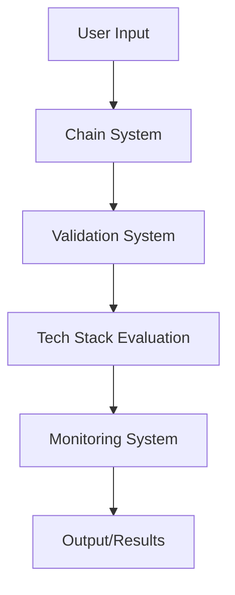

# Architecture Documentation

## System Overview

This project implements a chain-based prompt system specifically designed for the Windsurf environment, leveraging Cascade AI capabilities for enhanced software development.

## Core Components

### 1. Chain System
```
.windsurf/
├── config.json         # Main configuration
└── commands/
    └── chain-commands.json  # Chain definitions
```

- **Purpose**: Manages the flow of development processes
- **Key Features**:
  - Sequential command execution
  - State management
  - Error handling
  - Progress tracking

### 2. Validation System
```
prompts/validation/
├── validation-rules.json    # Validation criteria
└── validators/
    ├── vision-validator.js
    ├── requirements-validator.js
    └── tech-stack-validator.js
```

- **Purpose**: Ensures quality and consistency
- **Validation Types**:
  - Vision statement validation
  - Requirements validation
  - Tech stack compatibility
  - Architecture consistency

### 3. Tech Stack Evaluation
```
prompts/tech-stack/
├── stack-evaluation.json    # Evaluation criteria
└── stack-validator.md      # Validation process
```

- **Purpose**: Automated technology selection
- **Features**:
  - Project requirements analysis
  - Stack compatibility checking
  - Performance metrics
  - Development efficiency scoring

### 4. Monitoring System
```
prompts/monitoring/
├── update-monitor.md       # Update checking
└── security-monitor.md     # Security scanning
```

- **Purpose**: Continuous system health checking
- **Monitoring Areas**:
  - Package updates
  - Security vulnerabilities
  - Performance metrics
  - System health

## Data Flow



## Integration Points

### 1. Windsurf Integration
- Direct integration with Windsurf IDE
- Access to Cascade AI capabilities
- Real-time feedback system

### 2. External Tools
- Package managers
- Version control systems
- Testing frameworks
- Deployment systems

## Security Considerations

1. **Input Validation**
   - User input sanitization
   - Command injection prevention
   - Path traversal protection

2. **Data Security**
   - Secure storage of configurations
   - Protected API keys
   - Encrypted sensitive data

## Performance Optimization

1. **Chain Execution**
   - Parallel processing where possible
   - Caching of frequent operations
   - Resource usage optimization

2. **Memory Management**
   - Efficient data structures
   - Resource cleanup
   - Memory leak prevention

## Error Handling

1. **Error Types**
   - Validation errors
   - Chain execution errors
   - System integration errors
   - Resource access errors

2. **Recovery Mechanisms**
   - Automatic retry logic
   - Fallback options
   - State recovery
   - Error logging

## Future Considerations

1. **Scalability**
   - Support for larger projects
   - Multiple chain execution
   - Distributed processing

2. **Extensibility**
   - Plugin system
   - Custom validators
   - New chain types
   - Additional monitoring metrics

## Development Guidelines

1. **Code Organization**
   - Modular structure
   - Clear separation of concerns
   - Consistent naming conventions
   - Documentation requirements

2. **Testing Strategy**
   - Unit tests for validators
   - Integration tests for chains
   - Performance benchmarks
   - Security testing

## Configuration Management

1. **System Configuration**
   ```json
   {
     "chainSystem": {
       "maxRetries": 3,
       "timeout": 30000,
       "parallel": true
     },
     "validation": {
       "strict": true,
       "autoFix": false
     },
     "monitoring": {
       "interval": 3600,
       "alerts": true
     }
   }
   ```

2. **Environment Variables**
   - `CHAIN_SYSTEM_ENV`
   - `VALIDATION_LEVEL`
   - `MONITOR_INTERVAL`
   - `DEBUG_MODE`

## Deployment

1. **Requirements**
   - Node.js environment
   - Windsurf IDE
   - Required dependencies
   - System permissions

2. **Installation Steps**
   - System preparation
   - Dependency installation
   - Configuration setup
   - Integration testing

## Maintenance

1. **Regular Tasks**
   - Log rotation
   - Cache clearing
   - Configuration updates
   - Security patches

2. **Monitoring**
   - System health checks
   - Performance metrics
   - Error rates
   - Usage statistics
